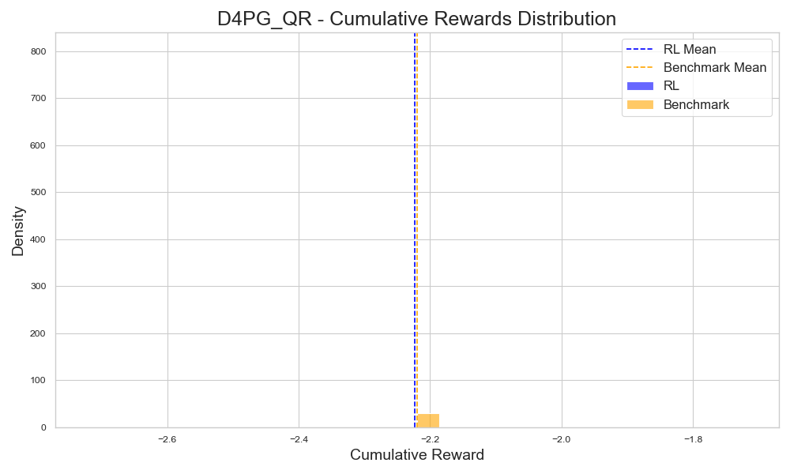
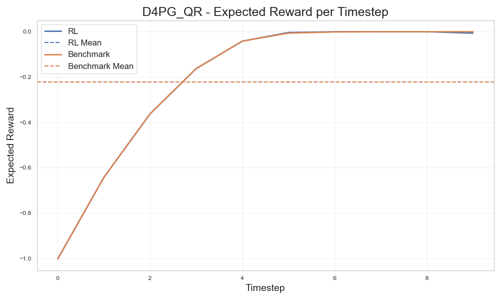
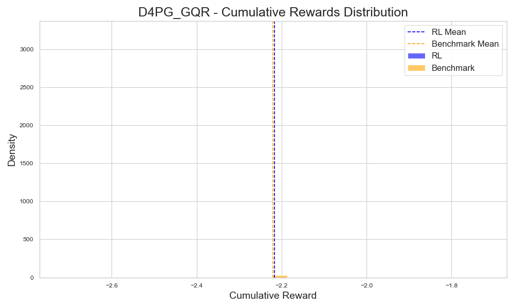
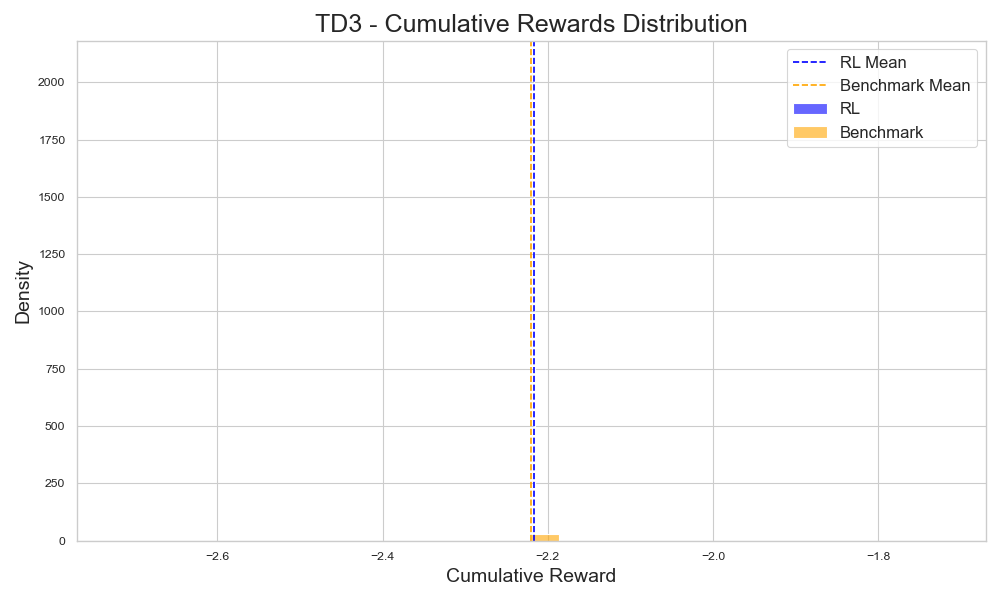
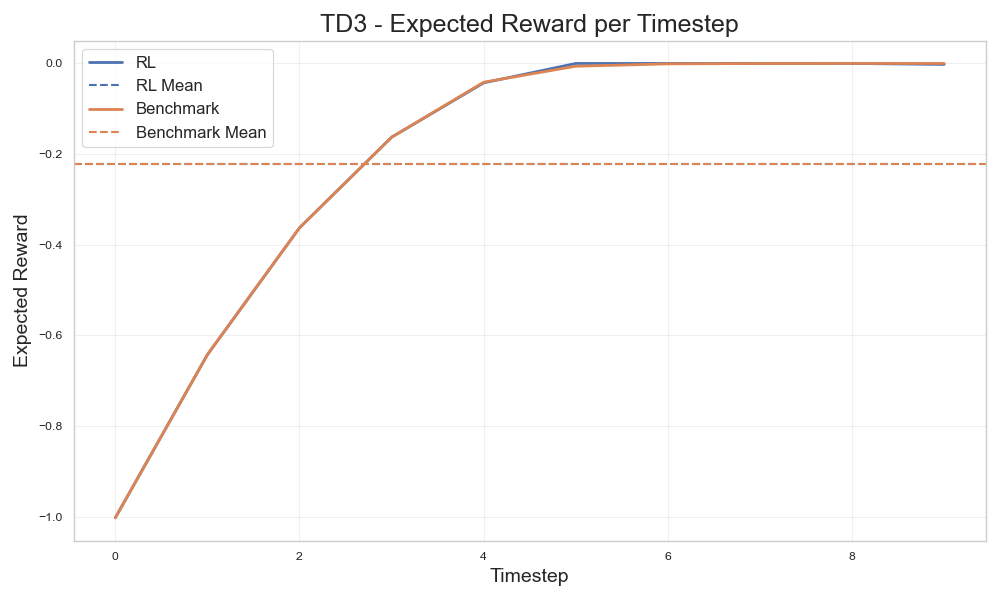
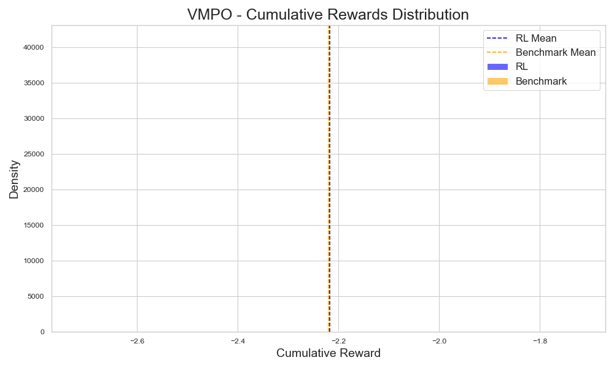
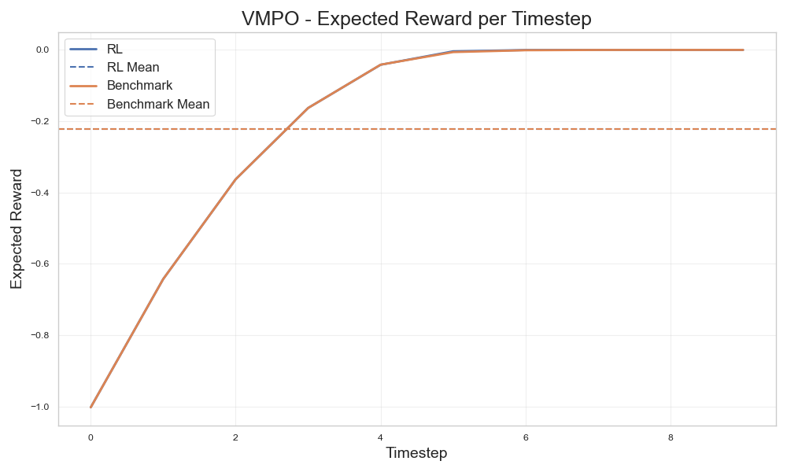
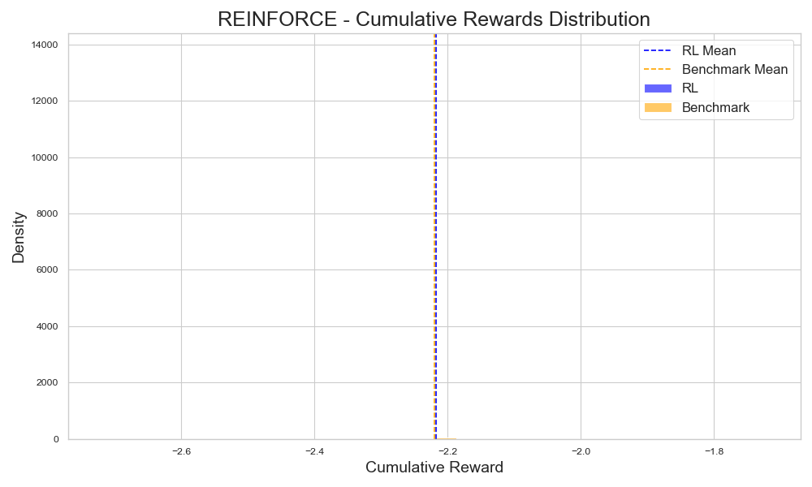
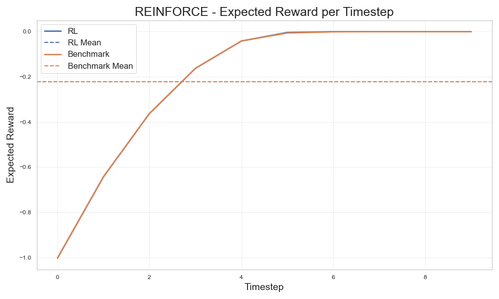

# Reinforcement Learning for Stochastic Optimisation under Model Misspecification
This repository implements several reinforcement learning algorithms from scratch in PyTorch, with a specific focus on finite-horizon stochastic control problems where:
- the time horizon is fixed
- episodes do not terminate early
- optimisation is performed in parallel over Monte Carlo paths

These structural assumptions allow the implementations to remain compact, explicit, and mathematically transparent, while still covering a wide class of problems relevant to optimal control and quantitative finance.

The central goal of the repository is not to apply RL to arbitrary black-box MDPs, but to study the question:
> How and when reinforcement learning improves upon classical analytic solutions once their modeling assumptions no longer hold.

## Core idea
We proceed in two stages:

1. Analytic baseline:
we start from a control problem that admits a closed-form or semi-analytic solution (finite-horizon Linear–Quadratic control). This solution is computed explicitly and serves as a strong, interpretable benchmark.

2. Controlled nonlinearity / misspecification:
we then modify the environment in economically or physically plausible ways (e.g. nonlinear market impact, convex costs, saturation effects), while keeping the same state and action space.
The analytic solution is no longer optimal under these modified dynamics, but is still deployed as a baseline controller.

Reinforcement learning algorithms are trained on the true (nonlinear) environment and compared directly against the analytic controller derived from the simplified model.

This setup allows us to answer a very specific question:
> How much performance is lost by relying on an analytically convenient but misspecified model, and can RL recover that loss?

## Benchmark
The benchmark is linear quadratic Gaussian control. The aim is to minimise 
$$\mathbb{E}[x_N^T F x_N + \sum_{i=0}^{N-1}(x_i^TQ_ix_i + u_i^T R_i u_i)]$$
where $x_i$ is the state, $u_i$ is the control (i.e. the agent's action), $F$ is the final state penalty, $Q_i$ is the state penalty, and $R_i$ is the control penalty. The latter two penalty matrices are allowed to be time-dependent. There is an analytic solution to this problem, which we calculate, and then compare to the policy learned by the algorithm. 

## From Linear Control to Nonlinear Environments

To demonstrate the limits of analytic control, the linear benchmark environment is systematically extended while keeping the same API and state/action structure.

Examples of extensions include:
- nonlinear or saturating control effects,
- convex (non-quadratic) action costs,
- nonlinear state dynamics inspired by execution and market impact models.

Crucially:
- the analytic controller is not retrained for these environments,
- it is applied “as-is”, representing a practitioner relying on a simplified model,
- RL agents are trained directly on the true nonlinear dynamics.

This creates a clean separation between:
- model-based optimal control under simplifying assumptions, and
- model-free learning under the true dynamics.

## Algorithms Implemented

The repository contains from-scratch implementations of several RL algorithms suited to continuous control and finite horizons, including:

- REINFORCE with baselines,
- PPO (clipped policy gradient),
- VMPO (variational MPO),
- Deterministic actor–critic methods,
- Distributional critics (D4PG quantile regression).

All algorithms are implemented explicitly, without relying on external RL frameworks, in order to keep the learning dynamics and assumptions transparent.

## D4PG Quantile Regression
**Figure 1:** Distribution of cumulative rewards under the nonlinear execution environment.

**Figure 2:** Average reward per time step over all Monte Carlo paths under the nonlinear execution environment.

## D4PG Generalised Quantile Regression
**Figure 1:** Distribution of cumulative rewards under the nonlinear execution environment.

**Figure 2:** Average reward per time step over all Monte Carlo paths under the nonlinear execution environment.

## TD3
**Figure 1:** Distribution of cumulative rewards under the nonlinear execution environment.

**Figure 2:** Average reward per time step over all Monte Carlo paths under the nonlinear execution environment.

## PPO
**Figure 1:** Distribution of cumulative rewards under the nonlinear execution environment.

**Figure 2:** Average reward per time step over all Monte Carlo paths under the nonlinear execution environment.

## VMPO
**Figure 1:** Distribution of cumulative rewards under the nonlinear execution environment.

**Figure 2:** Average reward per time step over all Monte Carlo paths under the nonlinear execution environment.

## REINFORCE
**Figure 1:** Distribution of cumulative rewards under the nonlinear execution environment.

**Figure 2:** Average reward per time step over all Monte Carlo paths under the nonlinear execution environment.

