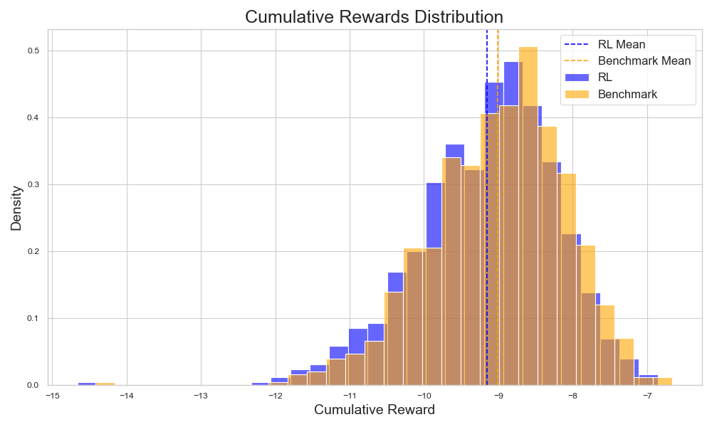
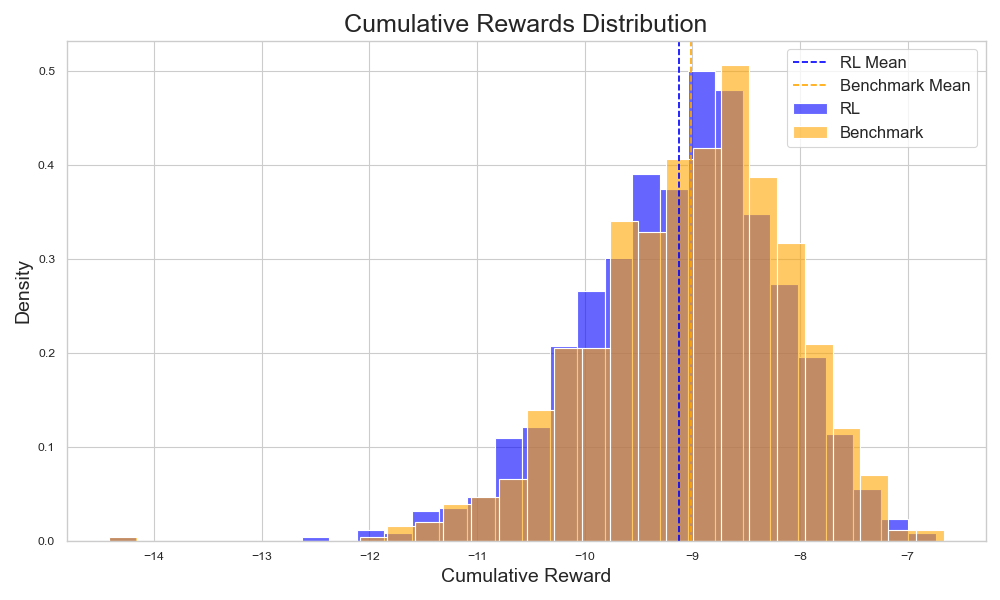
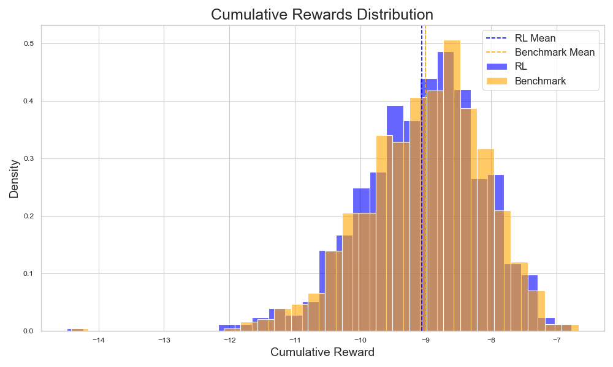
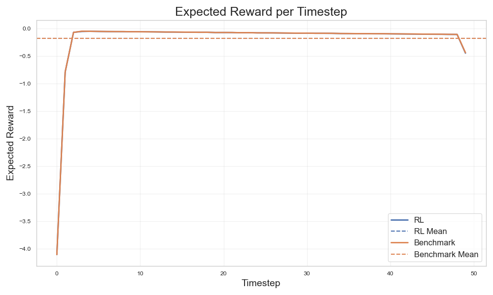

# Reinforcement Learning for Stochastic Optimisation
This repository implements various reinforcement learning algorithms from scratch, using only PyTorch. Rather than considering Markov Decision Processes in their most general form, this repository assumed that the MDP in question has a fixed time horizon, that episodes cannot be terminated prematurely, and that stochastic optimisatiton is being performed over some number of Monte Carlo paths. This allows us to simplify the implementation of various algorithms tremendously.

## Benchmark
The benchmark is linear quadratic Gaussian control. To simplify things we assume perfect observation accuracy (i.e., no Kalman filter needs to be applied to observations). The aim is to minimise 
$$\mathbb{E}[x_N^T F x_N + \sum_{i=0}^{N-1}(x_i^TQ_ix_i + u_i^T R_i u_i)]$$
where $x_i$ is the state, $u_i$ is the control (i.e. the agent's action), $F$ is the final state penalty, $Q_i$ is the state penalty, and $R_i$ is the control penalty. The latter two penalty matrices are allowed to be time-dependent. There is an analytic solution to this problem, which we calculate, and then compare to the policy learned by the algorithm. 

### TD3

### PPO

### VMPO

